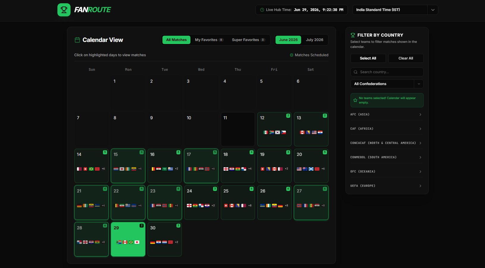

# ⚽ FanRoute: FIFA World Cup 2026 Interactive Hub

**FanRoute** is an interactive web app to explore, track, and filter matches for the **FIFA World Cup 2026** (June 11 – July 19, 2026).

## 📅 Features
- **Interactive Calendar**: June & July 2026 monthly view with dynamic flag icons, schedule drawers, and View Modes (All / Favorites / Super Favorites).
- **Team Filters**: Filter by 48 qualified countries with quick select/clear, search, and confederation groups.
- **Super Favorites (🌟)**: Pin up to 3 teams to highlight matches with premium emerald pulsing accents and stars.
- **Timezone & Live Clock**: Kickoff time conversions with a ticking mock clock synced to the tournament start.
- **Countdowns**: Real-time countdowns for upcoming fixtures, plus **LIVE** and **Finished** match statuses.

## 🛠️ Tech Stack
- **Frontend**: React 19, TypeScript, Tailwind CSS (v4), Vite 6, Lucide React.
